# WuWa Lab

> An unofficial Wuthering Waves companion for Android — track your Waveplates, plan your pulls, and see exactly where every Astrite goes.

## Overview

WuWaLab is a free, offline companion and tracker app for Wuthering Waves, built natively with Kotlin and Jetpack Compose (Material 3). It watches the clock so you don't have to: Waveplate regeneration, Crystal overflow, Lunite Pass check-ins, Astrite income and spending, convene odds, and your day-to-day planning — all from your home screen, a floating bubble, or the app itself.

**It never touches the game.** WuWaLab does not log into your account, read game files, automate anything, or talk to Kuro Games' servers. Everything you see is something you told it.

> [!CAUTION]
> The app is still in its early development and testing phase. Bugs may be prevalent.

## Disclaimer

> [!NOTE]
> WuWaLab is an unofficial, community-made fan project and is **NOT** affiliated with, endorsed by, or sponsored by Kuro Games.
>
> This application is provided free of charge, contains no advertisements, and is intended solely as an offline companion utility for the Wuthering Waves community.
>
> All trademarks, game assets, artwork, character names, logos, and other intellectual property referenced or displayed within this project are the property of their respective owners. If you are the rights holder and believe any content should be removed or credited differently, please contact me and I will promptly address the issue.
>
> The app explains all of this itself the first time you open it, via a one-time "How WuWaLab Works" dialog — tick the checkbox there if you'd rather not see it on future launches.

## Table of Contents

* [Overview](#overview)
* [Disclaimer](#disclaimer)
* [Screenshots](#screenshots)
* [Getting Started / Installation](#getting-started--installation)
* [Finding Your Way Around](#finding-your-way-around)
* [Permissions](#permissions)
* [Features](#features)
* [The Two Currencies](#the-two-currencies)
* [Adding Your Own Shop Artwork](#adding-your-own-shop-artwork)
* [FAQ](#faq)
* [Support](#support)

---

## Screenshots

<!--
  SCREENSHOT FORMAT
  ------------------
  Drop your screenshots into an "img" folder at the repo root, e.g.:

    /img/dashboard.png
    /img/astrite_tracker.png
    /img/economic_dashboard.png
    /img/pull_planner.png
    /img/pull_planner_curve.png
    /img/convene_log.png
    /img/app_shop.png
    /img/shop_equipped.png
    /img/overlay_bubble.png
    /img/widget_landscape.png
    /img/widget_compact.png
    /img/profile_studio.png
    /img/planner.png
    /img/matrix.png
    /img/landscape_dashboard.png
    /img/event_detail_popup.png

  Then reference each one below with standard Markdown image syntax,
  relative to the repo root (no leading slash needed on GitHub).
  For a side-by-side row, wrap them in an HTML table - GitHub renders
  inline HTML fine inside Markdown.
-->

### The essentials

| Dashboard | Astrite Tracker | Home Widget |
| :---: | :---: | :---: |
| 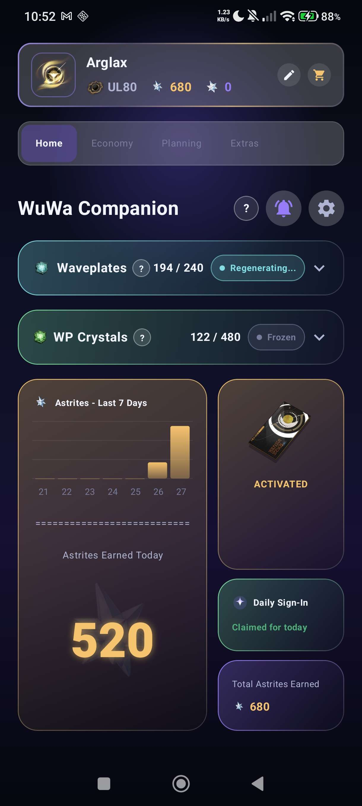 | 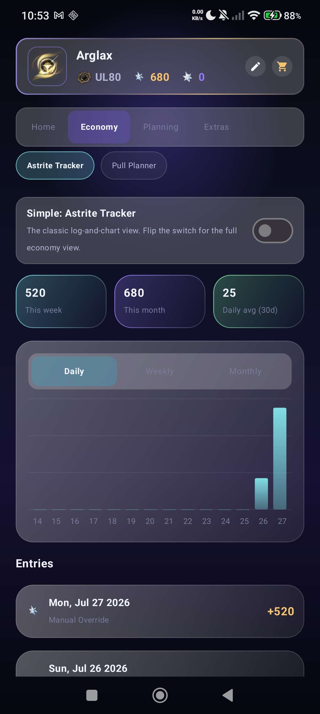 | 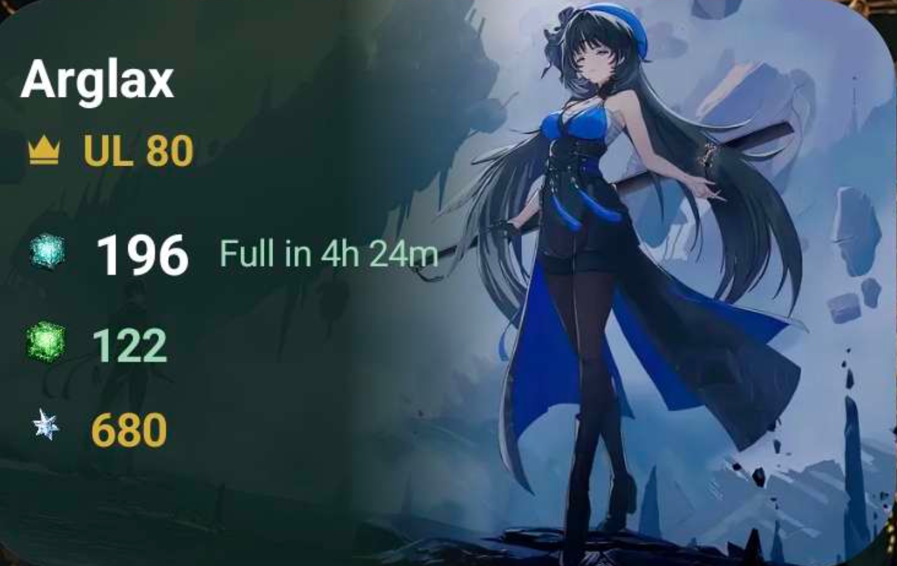 |

### Planning your pulls

| Pull Planner | Probability Curve | Convene Log |
| :---: | :---: | :---: |
| 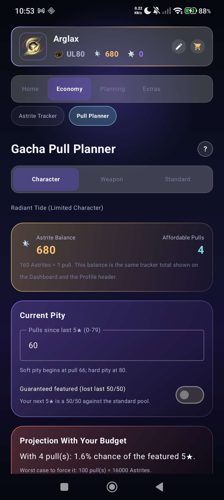 | 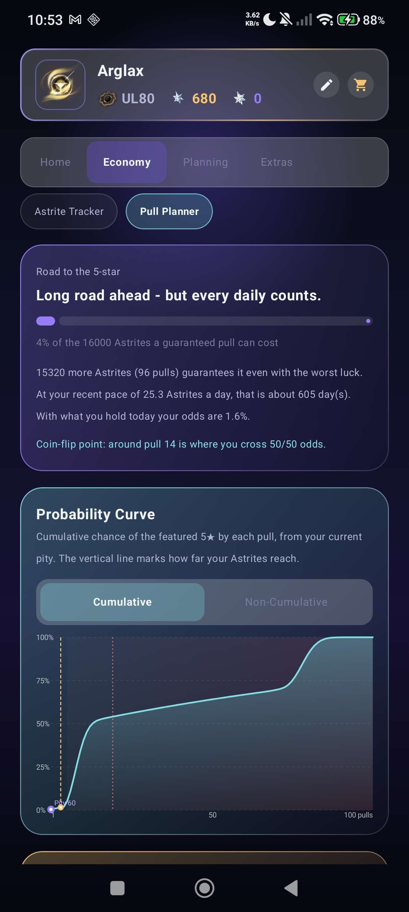 | 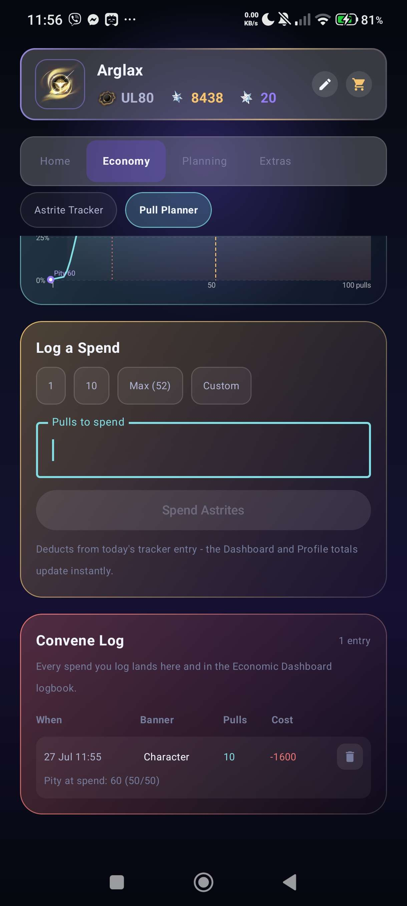 |

### The economy view

| Economic Dashboard | Logbook | App Shop |
| :---: | :---: | :---: |
| 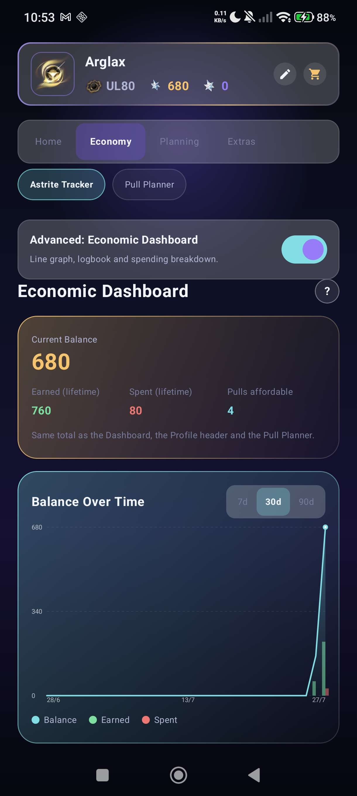 | 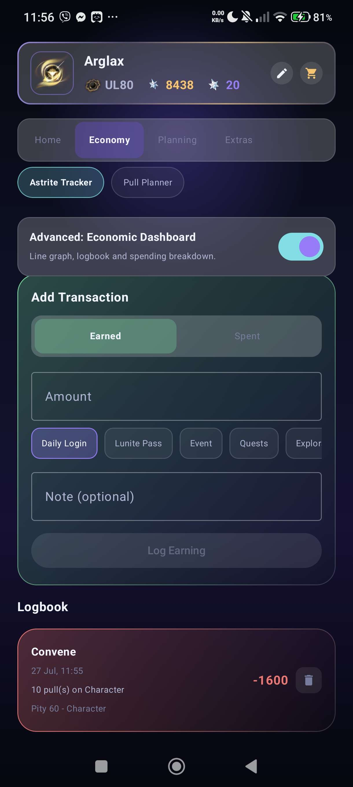 | 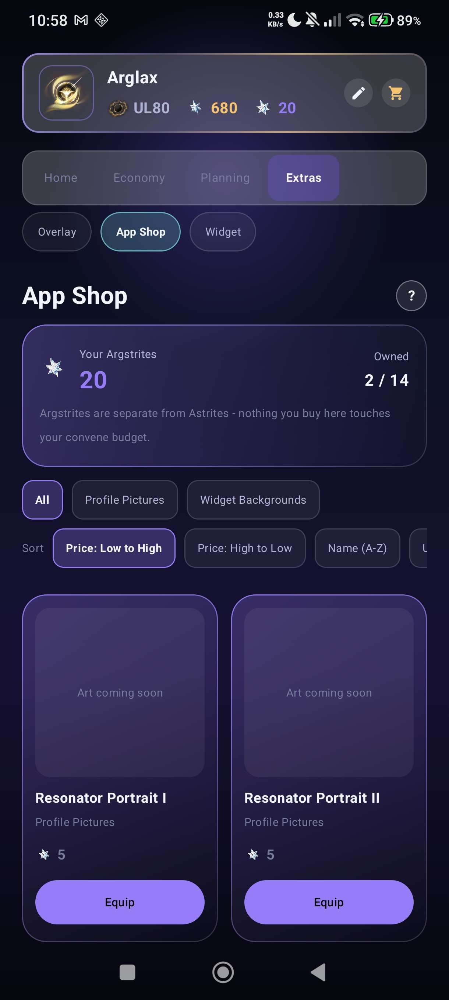 |

### Personalization

| Widget Studio | Profile Studio | Event Detail Popup |
| :---: | :---: | :---: |
| 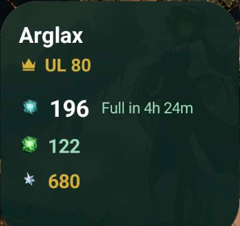 | 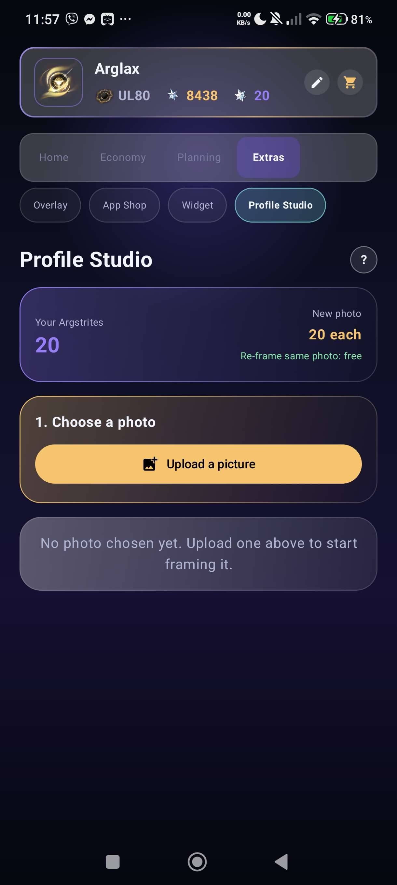 | 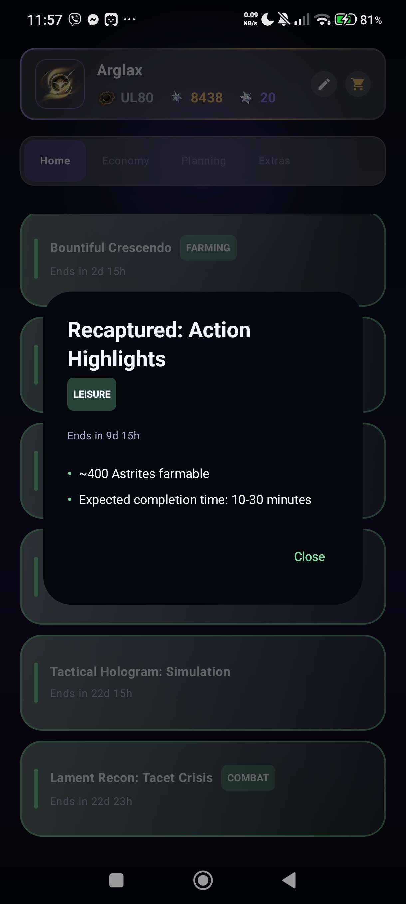 |

### Extras

| Floating overlay | Eisenhower Matrix | Landscape layout |
| :---: | :---: | :---: |
| 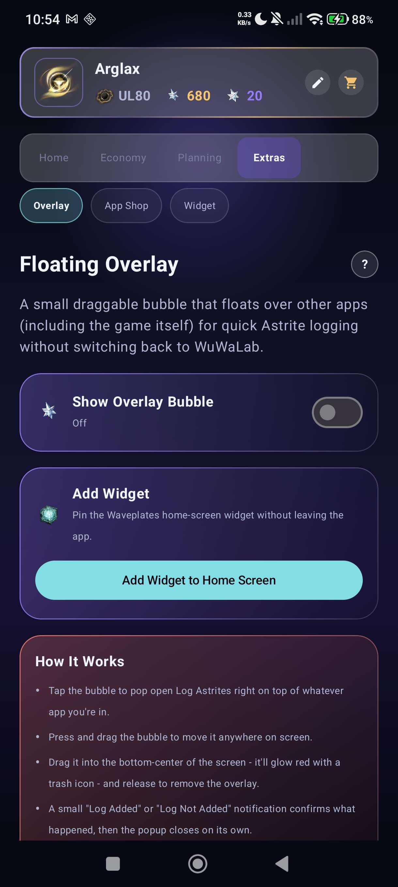 | 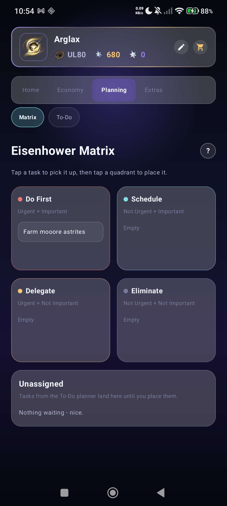 | 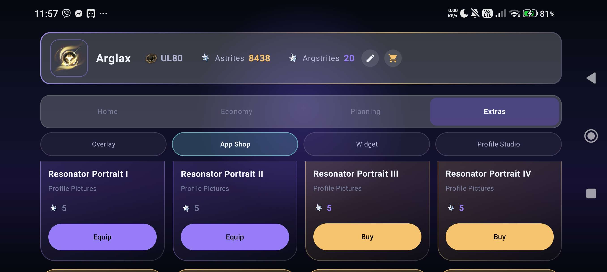 |

---

## Getting Started / Installation

> [!IMPORTANT]
> **Minimum Requirements**
> * **OS:** Android 11 or higher (minSdk 30, targetSdk 37)
> * **Storage:** At least 50MB of free space
> * **Permissions:** See [Permissions](#permissions) — most are optional and only needed if you use that specific feature.

### Install steps

1. Go to the [Releases](../../releases) page and download the latest `.apk` (e.g. `wuwalab_alpha-<version>.apk`).
2. On your Android device, tap the downloaded APK to begin installation.
   * First time installing from outside the Play Store? Android will ask permission — tap **Settings** on the prompt, enable **Allow from this source**, go back, and tap the APK again.
3. Tap **Install**, then **Open**.
4. Read the one-time **"How WuWaLab Works"** dialog, then tick "Don't show this again" or just tap **Got it**.
5. Set your **IGN** and **Union Level**, and enter your current **Waveplates** and **Crystals** so the math starts from the right place.
6. *(Optional)* Allow notifications so "Notify Me" alerts can reach you.
7. *(Optional)* Open **Extras → Overlay** to turn on the floating bubble, or tap **Add Widget to Home Screen**.

### Staying updated

The app checks GitHub for new releases on its own, tells you when one exists, and can download and install it for you. Pull-to-refresh on the Dashboard checks immediately.

---

## Finding Your Way Around

Everything used to sit in one long row of tabs. It's now grouped into four sections, so you tap a **group** first and only that group's pages appear beneath it. Fewer things on screen, nothing hidden.

| Group | What's inside | What it's for |
| --- | --- | --- |
| **Home** | Dashboard | Waveplates, Crystals, daily sign-in, events, at-a-glance totals. |
| **Economy** | Astrite Tracker, Pull Planner | Everything about Astrites — earning them, and spending them on convenes. |
| **Planning** | Matrix, To-Do | Your own goals and chores, unrelated to currency. |
| **Extras** | Overlay, App Shop, Widget Studio, Profile Studio | The floating bubble, cosmetics you buy with Argstrites, and the two Studios. |

You can still swipe left and right anywhere to move between pages — the tabs and the swipe stay in sync. Both rows adapt automatically: they share the width evenly in landscape and scroll sideways like chips in portrait.

---

## Permissions

WuWaLab only requests permissions tied to specific optional features — nothing here is used for tracking, ads, or telemetry.

| Permission | Why it's needed |
| --- | --- |
| Internet / Network State | Fetches live event banners and checks for app updates on GitHub. |
| Post Notifications | Powers "Notify Me" alerts (waveplates full, crystals maxed, custom thresholds, Lunite Pass reminders, event countdowns) and overlay logging confirmations. |
| Schedule Exact Alarm | Fires the daily Lunite Pass check-in reminder at the right Server Time reset. |
| Display Over Other Apps | Required only if you enable the Floating Overlay bubble. |
| Request Install Packages | Lets the in-app update checker install a newly downloaded APK directly. |
| Receive Boot Completed | Re-schedules reminders and alarms after your device restarts. |
| Foreground Service | Keeps the Overlay bubble alive while it's active. |

---

## Features

### Feature Overview

| Feature | Description |
| --- | --- |
| **Resource Tracking** | Waveplates and Crystals with accurate, game-accurate regeneration and caps. |
| **Astrite Tracker** | Log what you earn, see a 7-day chart, watch your running total. |
| **Economic Dashboard** | Optional advanced view: balance line graph, full transaction logbook, earning vs spending breakdown. |
| **Pull Planner** | Convene odds from your real pity, a "how far am I" progress card, and a permanent convene log. |
| **App Shop** | Spend Argstrites on profile portraits and widget backgrounds. |
| **Widget Studio** | Upload your own photo, frame it, preview it, and set it as your widget background. |
| **Profile Studio** | Upload your own photo, frame it into a circle, and set it as your profile picture — re-framing the same photo later is free. |
| **Lunite Pass Support** | Daily check-ins, reminders, and totals. |
| **Floating Overlay** | Draggable bubble for quick Astrite logging (both earning and spending) over other apps, screen-size aware on rotation. |
| **Home Widget** | Live Waveplate countdown on your home screen, with a background you can change. |
| **Planners** | Pull Planner, To-Do list, and an Eisenhower Matrix. |
| **Grouped Navigation** | Four tidy sections instead of one crowded tab row. |
| **Event Detail Popups** | Tap any event banner for a full breakdown, driven entirely by a bundled/remote `events.json`. |

<strong>Full feature list (click to expand)</strong>

#### Resource Tracking (Waveplates & Crystals)

* Accurate passive regeneration: **+1 Waveplate every 6 minutes**, **+1 Crystal every 12 minutes**.
* Respects the game's real limits — Waveplates soft-cap at 240 (with a manual override up to 2400 for overloaded states), Crystals hard-cap at 480 and can never be pushed past it.
* Live status indicators: Depleted, Regenerating, Full, Overloaded, plus a "Frozen" state for Crystals while Waveplates haven't capped yet.
* Manual entry cards for both, so you can correct the count any time you spend or gain in-game.

#### Astrite Tracker — Simple mode

The original, lightweight view, completely unchanged:

* Log the Astrites you earn each day, with an optional note for where they came from.
* A 7-day bar chart on the Dashboard, plus weekly, monthly, and lifetime totals.
* Daily, weekly and monthly chart periods.

#### Economic Dashboard — Advanced mode

A switch at the top of the Astrite page flips between **Simple** and **Advanced**. Advanced is off by default, your choice is remembered, and both views read exactly the same saved data — switching back and forth never changes or loses anything.

* **Balance line graph** over 7, 30 or 90 days, with green earning bars and red spending bars underneath, and a dot marking today's live balance.
* **Full logbook** — every single transaction, newest first, with its date, category, note and amount. Convene spends logged from the Pull Planner show the banner, pull count, and the pity you were on at the time. Spends logged from the Overlay bubble show up here too, under "Overlay Quick Spend".
* **Add Transaction** — log an earning or a spend by hand, pick a category (Daily Login, Event, Quests, Convene, Shop…), and add a note.
* **Breakdown grid** — earned, spent and net figures for this week and this month, your average earned and spent per day, and an estimate of how many days until your next pull.
* Swipe-free deletion: remove any row you logged by mistake.

**About the numbers — the rules that never bend:**

* **Astrites Earned** is a lifetime total that only ever goes up. It can never be negative, no matter how much you convene.
* **This week / this month** figures are *net* (earned minus spent). Those **can** go negative — if you spent more than you collected, that genuinely happened, and the tracker says so instead of hiding it.
* **Your daily average is built from earnings only**, so a big convene session never drags it below zero. Spending has its own separate average.
* **Your balance can never go below zero.** Every spend is checked against what you actually hold, in the planner, the shop, the overlay, and the manual entry form alike.

Every number on this page is the same number the Dashboard, the Profile header and the Pull Planner show. There is one source of truth, so nothing can quietly disagree.

#### Pull Planner

* Pick a banner (Character, Weapon, Standard), type in your current pity, and flip the guarantee switch if you lost your last 50/50.
* A **probability curve** projecting your odds pull by pull, with three markers drawn right on it:
  * a violet **"You are here"** dot anchored to the pity you entered,
  * an amber **budget line** showing how far your current Astrites actually reach,
  * a red **hard pity line** at the pull where a 5-star becomes certain.
* **"Road to the 5-star" card** — the plain-English answer to *how far am I?* It gives you a progress bar, the exact number of Astrites and pulls still needed to guarantee the character even with the worst possible luck, roughly how many days that is at your recent earning pace, and the pull number where your odds cross 50/50.
* **Convene Log** — every spend you record becomes a permanent row: when it happened, which banner, how many pulls, what it cost, and whether you were on a guarantee. It's a proper record, not just a running total, and the same rows appear in the Economic Dashboard's logbook.
* Logging a spend updates your balance everywhere in the same instant. If a spend would overdraw you, the button won't let it happen.

#### App Shop

* Opened by the new **cart button** in your profile header, right beside the edit pencil, or from **Extras → App Shop**.
* Spends **Argstrites only** — the app's own currency. Your real Astrite convene budget is never touched.
* **Profile pictures — 5 Argstrites each.** Equip one and it replaces the portrait in your header.
* **Widget backgrounds — 10 Argstrites each.** Equip one and the artwork behind your home-screen widget changes immediately.
* **Sort** by price (low to high or high to low), by name, or unowned-first. **Filter** by category.
* Owned items switch from *Buy* to *Equip*, and equipping one shows a green check on its tile. You can unequip at any time to go back to the free default.
* You can't overspend. If an item costs more than you hold, the button is disabled and tells you exactly how many Argstrites you're short. A second check runs inside the purchase itself, so even a double-tap can't push you negative.
* An in-app way to **earn** Argstrites through gameplay is planned — for now, the Daily Sign-In card is your income.

#### Lunite Pass Management

* Toggle Lunite Pass tracking on or off to fold in your daily +90 Astrites.
* Reminder notifications scheduled around the real Server Time reset (4:00 AM Manila / UTC+8).
* The Daily Sign-In card grants a flat **+10 Argstrites** once per game day, and automatically folds in the Lunite Pass's **+90 Astrites** when it's active — one tap, one confirmation showing both rewards side by side.

#### Notify Me / Alerts

* Push notifications when Waveplates hit full, Crystals hit the 480 cap, or a custom Waveplate threshold you choose is reached.
* Event reminders at 3 days and 1 day before an event window closes.
* Debounced, so you're notified once per threshold crossing rather than repeatedly.
* Every notification now carries a small category header ("WuWaLab · Waveplates", "WuWaLab · Overlay", "WuWaLab · Events", etc.) above the title, so it's obvious at a glance what triggered it before you even open it — this applies across the whole app, but is most noticeable on Astrite logging notifications from the Overlay bubble ("Astrites Logged" / "Spend Logged"), which now clearly separate the two.

#### Floating Overlay Bubble

* A bubble that hovers over other apps, including the game itself.
* Tap it for a quick logging popup without opening the full app, with two modes:
  * **Add** — bumps today's earned Astrite total, exactly like before.
  * **Log Spend** — writes a real SPEND entry through the same ledger the Pull Planner and Shop use, so it shows up in the Economic Dashboard logbook under "Overlay Quick Spend" rather than just silently subtracting a number.
* Both modes share the same quick-amount chips (+10 / +60 / +100 / +160) and both append their own kind of entry.
* Press and drag to move it; drag to the bottom-centre (it glows red with a bin icon) to dismiss it.
* A confirmation notification appears after logging (or closing without logging), then the popup closes itself.
* **Fixed:** the bubble used to get "stuck" clamped to an old screen size after rotating the device, because its on-screen bounds were only ever read once, when the bubble was first created. The overlay now re-reads the current screen size and rebuilds itself on every orientation/configuration change, so it can always reach the whole screen, in either orientation.
* An **Add Widget** shortcut pins the home-screen widget in one tap on Android 8+.

#### Profile

* Set your In-Game Name and Union Level, and pick from the free bundled avatars (Default, Rover, Beacon), any portrait you've bought in the App Shop, or a custom photo from the Profile Studio.
* Tap the header for a read-only stats card explaining both currencies.
* Two buttons at the end of the header: the **edit pencil** on the left, the **shop cart** on the right.
* Layout adapts to orientation — portrait keeps your name on its own row so a long IGN never misaligns the stats, landscape lays everything out in a single line with full labels.

#### Widget Studio

* Found under **Extras → Widget**.
* **Upload any photo** (PNG, JPG, or JPEG) from your device and frame it — pinch to zoom, drag to reposition, or use the zoom and position sliders. A reset button puts it back to centre.
* **See it before you buy it.** Two live previews show exactly how it will look as a wide 4x2 widget and as a square 2x2 one, including the real dimming the widget applies.
* Applying a custom background costs **20 Argstrites**, and you're asked to confirm first because purchases are final. If the image can't be processed, nothing is charged.
* **First visit gives you 20 Argstrites free**, with a popup explaining why: a background costs 20, and earning that from daily sign-ins alone would take two days before you could even try the feature. It's a one-time starter.
* Reverting to the default artwork is free — only applying costs anything.
* Your photo never leaves your phone. It's copied into the app's private storage and flattened into a single image the widget draws.

#### Profile Studio

* Found under **Extras → Profile Studio** — the square sibling of the Widget Studio, built for your profile picture instead of your home-screen widget.
* **Upload any photo** (PNG, JPG, or JPEG) and frame it — pinch to zoom, drag to reposition, or use the sliders — into a circular preview that matches exactly how it'll look in your profile header.
* Applying a **new** photo costs **20 Argstrites**, same as the Widget Studio.
* **Re-framing is free.** If you just want to zoom, reposition, or otherwise re-touch the *same* photo you already applied, re-applying it costs nothing — you're only ever charged again for a genuinely different upload. The confirmation dialog and button both make it explicit whether a given apply will be free or charged before you tap it.
* Reverting to a bundled/shop avatar is free.
* Your photo never leaves your phone — same private, on-device storage approach as the Widget Studio.

#### Home Screen Widget

* Waveplates with a live "Full in Xh Ym" countdown, plus Crystals, Union Level and your Astrite total.
* Background artwork that respects whatever widget skin you've equipped in the shop, falling back to the bundled art.
* Full landscape size shows the art on the right and darkens the left where the numbers sit; small and square sizes use an even scrim so every value stays readable.
* **Tapping the widget opens a quick chooser** rather than dumping you on whatever page you last used — jump straight to the Dashboard, the Pull Planner, or your To-Do list, or set an alarm in your phone's own clock app.
* The dimming is a real gradient now: fully dark across the left 40% where the numbers sit, ramping away between 40% and 60%, and completely clear from 60% rightwards so your artwork is untouched on that side.
* Refreshes every 30 minutes in the background, and instantly whenever you change a value in-app.

#### Planning Tools

* **To-Do list** with reminders.
* **Eisenhower Matrix** for sorting tasks by urgency and importance.
* Both live under the Planning group, away from the currency pages.

#### Sound & Haptic Feedback

* Taps play the system click sound with a light haptic tick, using the platform's own sounds rather than bundled audio — so it automatically respects your volume, silent mode and "touch sounds" setting.

#### Event Tracking

* Upcoming / Live / Ended tabs pulled from a GitHub-hosted events cache, refreshed in the background.
* **Tap any event banner** to open a detail popup: its category (Farming, Convene, Combat, Leisure, or none for a plain featured event), its full countdown/expiry, and a bullet-point breakdown of what's actually in it (drop rates, featured characters, claimable rewards, farmable Astrite totals, and so on).
* Everything shown — name, dates, category, banner art, and the detail bullets — is read straight out of `assets/events.json` (or its GitHub-hosted counterpart), so adding or editing an event is a JSON edit, not a code change. See that file for the exact shape.

#### Update Checker

* Notifies you of new GitHub releases and can download and install them directly, with your permission.

---

## The Two Currencies

They're easy to mix up, so here's the short version:

| | **Astrites** | **Argstrites** |
| --- | --- | --- |
| What is it | The game's real convene currency | WuWaLab's own in-app currency |
| Where it comes from | You log what you earn in-game | +10 a day from the Daily Sign-In card |
| What it buys | Convenes, tracked in the Pull Planner | Profile pictures and widget backgrounds in the App Shop, and custom photo uploads in the Widget Studio and Profile Studio |
| Can it go negative | No — the balance floors at zero | No — purchases are blocked before that can happen |

The two pools never touch each other. Buying a portrait can't shrink your pull budget, and convening can't cost you a widget skin.

---

## FAQ

**Is this against the Terms of Service?**  
No. WuWaLab never reads game memory or files, never logs into your account, and never automates anything. It's a notepad with good maths.

**Why do I have to type my values in manually?**  
Because there is no sanctioned way to read live values out of the game. Manual entry is the honest, safe option.

**My weekly Astrites show a negative number. Is that a bug?**  
No — that's the net figure for the week, and if you convened more than you collected, it's supposed to be negative. Your *lifetime earned* total and your *daily average* never go negative.

**Will I lose my data if I switch to Advanced mode?**  
No. Both views read the same saved data. Switch as often as you like.

**Can I get my Astrites back after deleting a convene log row?**  
Deleting a row removes it from the log only — it doesn't refund the spend. Use the Add Transaction form if you need to correct a balance.

**I already applied a photo in Profile Studio. Why wasn't I charged again when I re-applied it?**  
Because it's the same photo — only re-positioned or re-zoomed. Profile Studio only charges Argstrites the first time a given photo is applied; re-framing and re-applying that same photo afterwards is free. Uploading a genuinely different photo will cost Argstrites again.

**Why did my overlay bubble seem stuck in one corner of the screen after I rotated my phone?**  
That was a real bug, now fixed — the bubble was clamping itself against the screen size from before the rotation. It now re-measures the screen and rebuilds itself every time your device's orientation changes.

---

## Support

If you hit a bug or have a feature request, please open an issue in this repository with a detailed description of what happened and what you expected.

---